# Architecture Diagrams

Generated from `.add/docs-manifest.json`. Source of truth is the Go code under `internal/`; if a diagram conflicts with the code, the code wins — regenerate via `/add:docs --scope diagrams`.

## Contents

- [System Overview](#system-overview)
- [Request Lifecycle](#request-lifecycle)
- [Authentication Middleware](#authentication-middleware)
- [Query Routing & NDC Normalization](#query-routing--ndc-normalization)
- [openFDA Compatibility Flow](#openfda-compatibility-flow)
- [Admin Load Trigger & Status](#admin-load-trigger--status)
- [Data Load Pipeline](#data-load-pipeline)
- [Checkpoint State Machine](#checkpoint-state-machine)
- [Resume After Failure](#resume-after-failure)
- [Health Check Flow](#health-check-flow)
- [Data Model (ER)](#data-model-er)

## System Overview

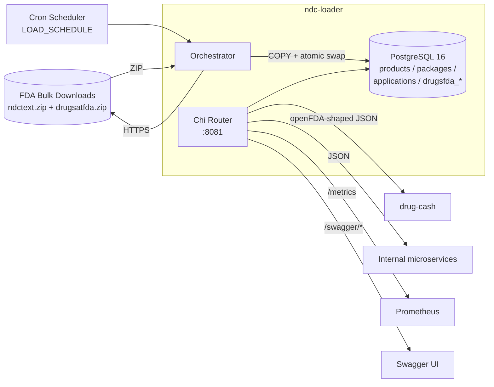

## Request Lifecycle

End-to-end happy path for an authenticated query request.

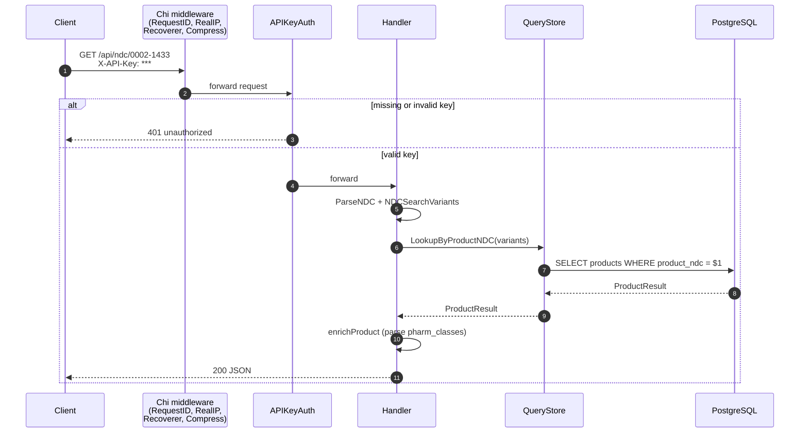

## Authentication Middleware

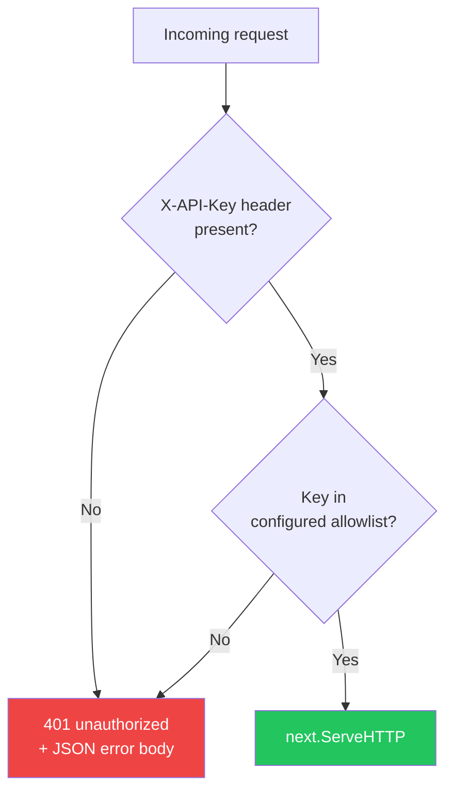

Configured via `APIKeyAuth([]string)` in `internal/api/middleware.go`. Operations endpoints (`/`, `/health`, `/version`, `/metrics`, `/swagger/*`) bypass this group.

## Query Routing & NDC Normalization

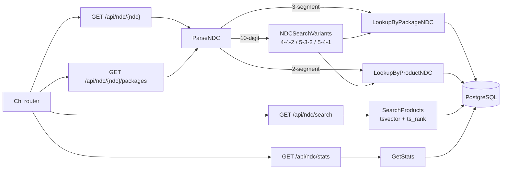

## openFDA Compatibility Flow

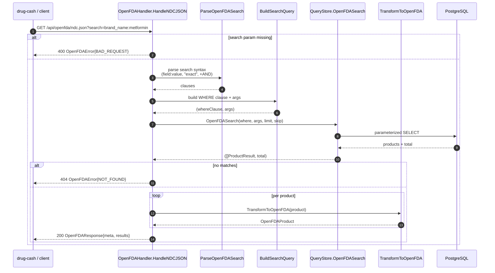

## Admin Load Trigger & Status

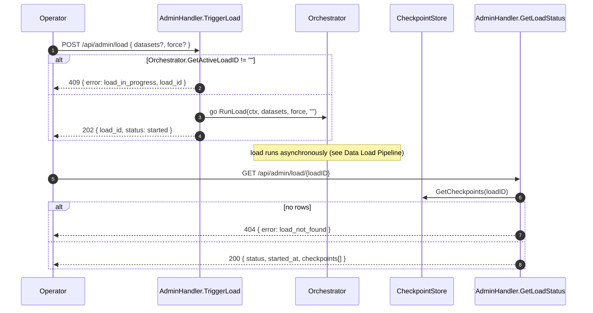

## Data Load Pipeline

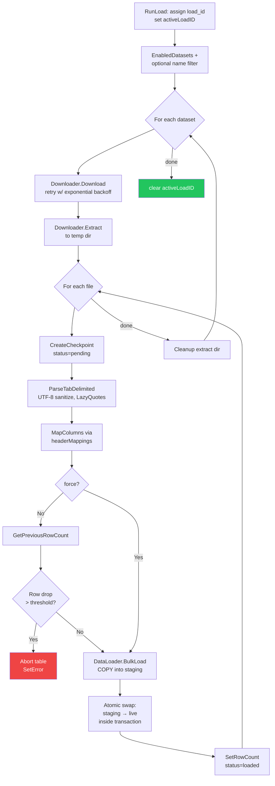

## Checkpoint State Machine

Per-table checkpoint lifecycle, defined in `internal/model/config.go` (`LoadStatus` constants) and driven by `CheckpointStore.UpdateStatus`.

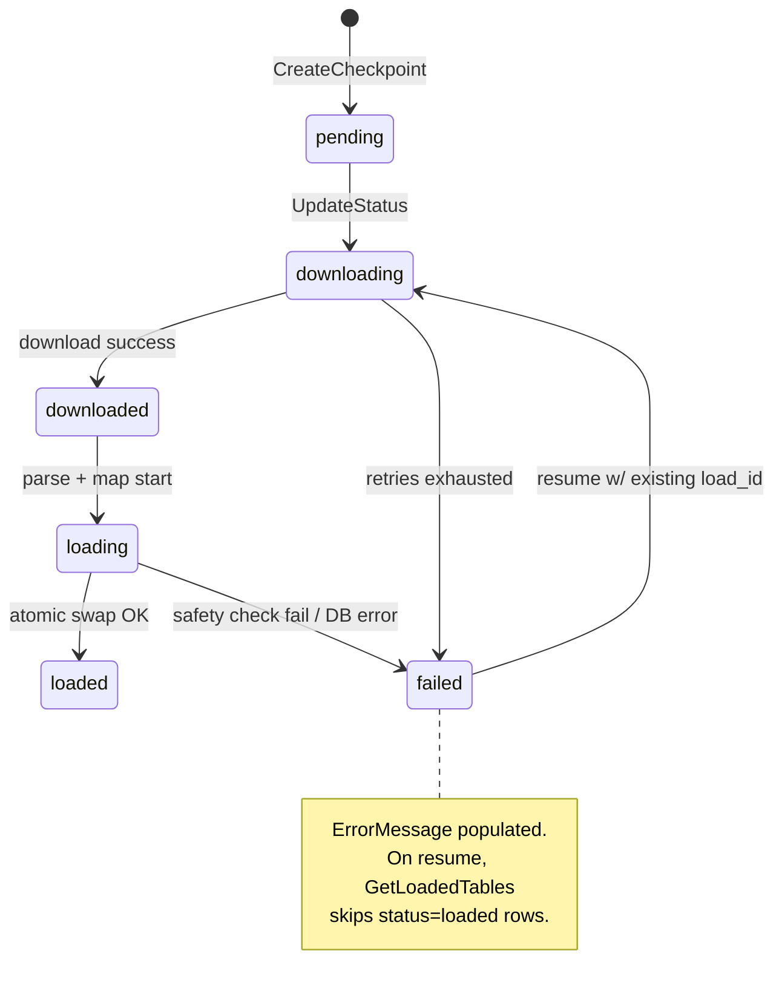

## Resume After Failure

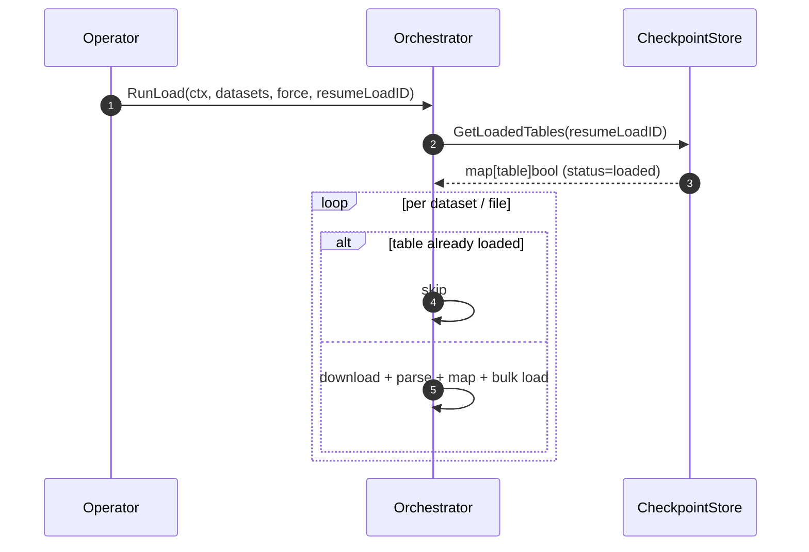

## Health Check Flow

`/health` is unauthenticated. Status degrades when the data is older than 48h or when no data has loaded yet; it errors only if PostgreSQL is unreachable.

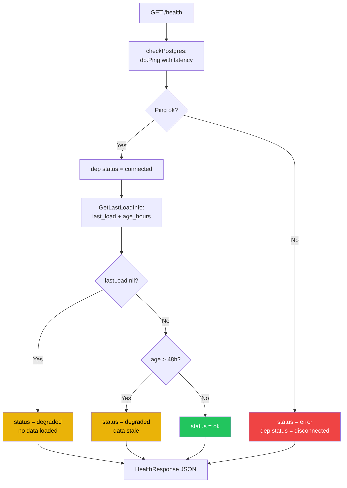

## Data Model (ER)

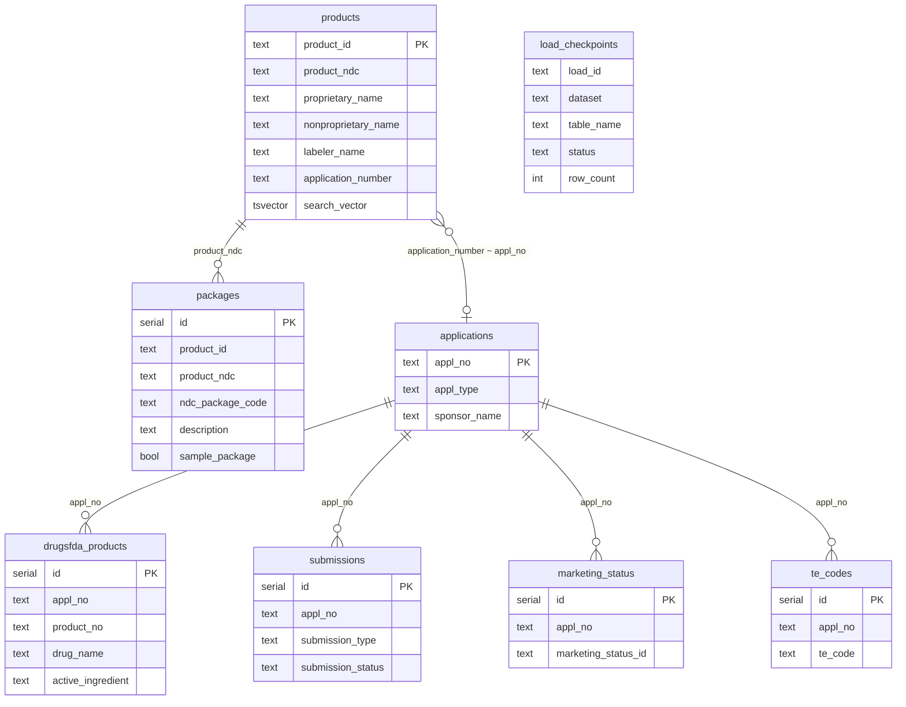

Join across datasets uses `products.application_number` (`ANDA076543`) → `applications.appl_no` (`076543`) after stripping the `NDA/ANDA/BLA` prefix.

---

*Last updated: 2026-05-16 — covers 12 routes, 5 middleware layers, 7 base tables + checkpoint table.*
